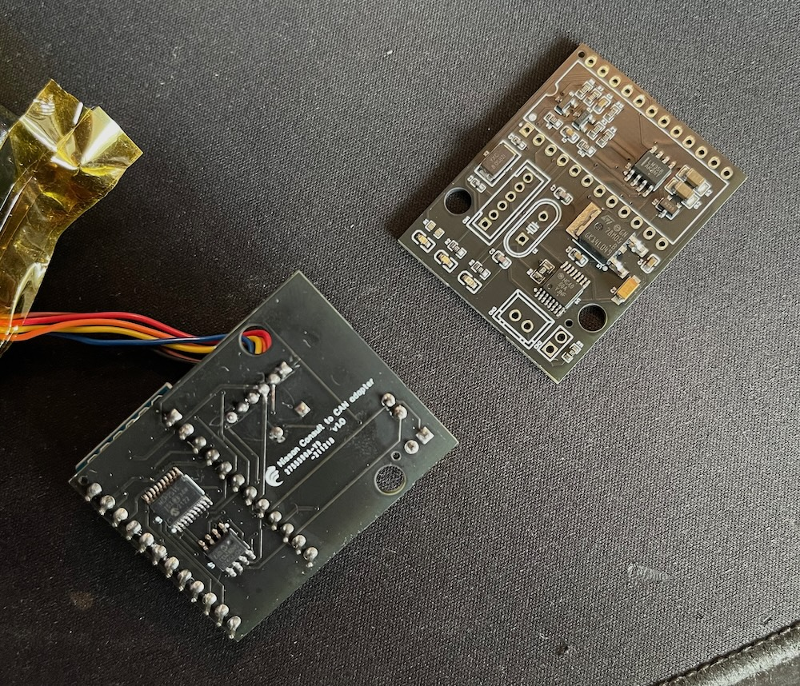

# Nissan Consult (14pin) to CAN adapter (Arduino-based)

## WARNING! OUTDATED! UNMAINTAINED! USE AT YOUR OWN RISC!

* Arduino Nano
* MCP2515
* MCP2562
* MC74HC4060

Project schematics and PCB design:
https://easyeda.com/editor#project_id=ac9ec5162c0b44318a7f248b36508bcd

     
